# Shipmozo Dev Helper — High-Level Architecture

**Version:** `dev-helper-v30` (see `GET /api/health`)  
**Production:** https://shipmozo-dev-helper-1.onrender.com  
**Target panel:** https://panel.appiify.com  

This document describes how the system is built today, how data flows through it, and the recommended path to scale. For hands-on testing instructions, see [TESTING-WORKFLOW.md](./TESTING-WORKFLOW.md).

---

## 1. Executive Summary

**Shipmozo Dev Helper** is an internal QA and developer productivity platform for the Shipmozo logistics panel. It combines:

| Capability | What it does |
|------------|--------------|
| **Module Docs** | AI-generated PRDs and user manuals with live Playwright screenshots |
| **Saved Reports** | Searchable library of generated documentation (RAG source for chat) |
| **Chat** | Q&A over saved manuals, optionally augmented with live panel browsing |
| **Test Dataset** | Hybrid API + UI test execution — Postman/Newman for APIs, Python Playwright for panel E2E |

The application is a **monolithic Node.js Express server** (`server.js`) that serves a **Babel-in-browser React SPA** and **spawns Python Playwright subprocesses** for browser automation. On Render, screenshots and reports are persisted to **Cloudinary**; everything else lives on ephemeral disk under `output/`.

---

## 2. System Context

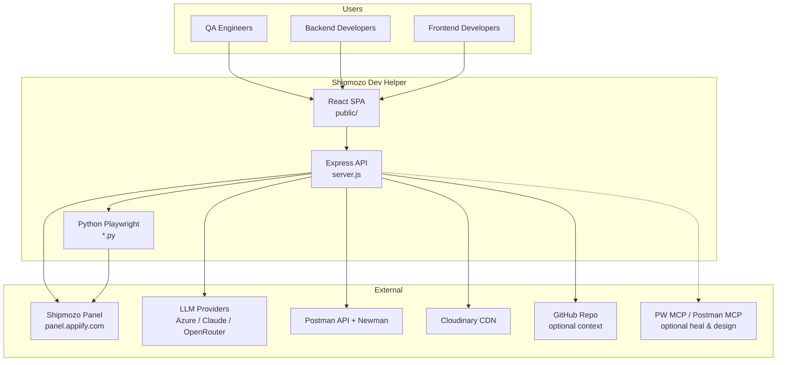

### Primary users and goals

| User | Primary workflows |
|------|-------------------|
| QA | Generate module docs, run hybrid test suites, review pass/fail evidence |
| Backend dev | Import Postman collections, run Newman API tests, generate API scenarios from PRDs |
| Frontend dev | Import Playwright E2E scripts, batch UI runs with one login session |
| Dev lead | Search saved reports, orchestrate docs → tests pipelines |

---

## 3. Deployment Topology

### 3.1 Production (Render)

Render runs a **native Node web service** — not Docker. Build installs Node deps, Python deps, and Playwright Chromium into `.playwright-browsers`.

| File | Role |
|------|------|
| `render.yaml` | Service blueprint: build, start, health check, env defaults |
| `scripts/render-build.sh` | `npm ci`, `pip install`, Playwright browser install |
| `server.js` | Single process: API + static UI + Python orchestration |

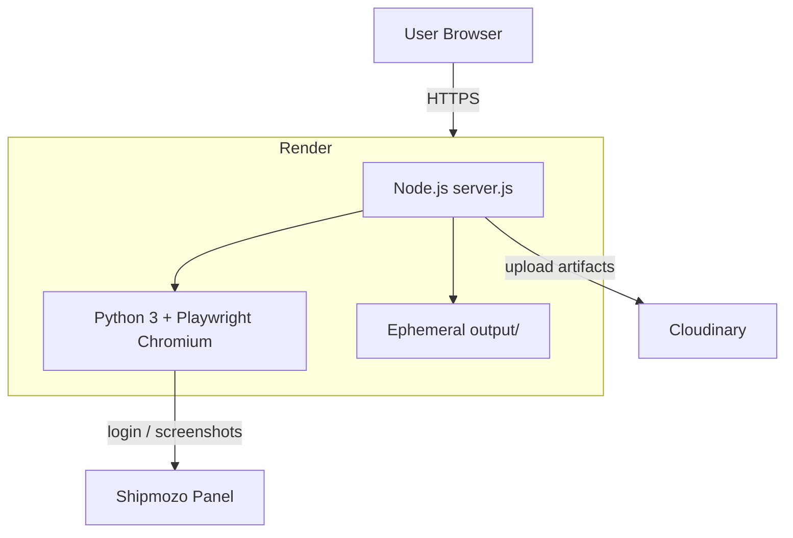

**Render defaults** (from `render.yaml`):

- `PUBLIC_TUNNEL=false` — no Cloudflare tunnel in production
- `IMAGE_STORAGE=cloudinary`, `REPORT_STORAGE=cloudinary`
- `HEADLESS=true`, `PLAYWRIGHT_MCP_AUTO_START=false`
- `CHAT_PROVIDER=azure-openai`
- `DOCS_RECORD_VIDEO=false` — screenshots only on Render free tier

### 3.2 Local development

| File | Role |
|------|------|
| `.env` / `.env.example` | Credentials and feature flags |
| `start-dev.bat` / `scripts/start-all.ps1` | Windows launchers |
| `lib/start-tunnel.js` | Optional Cloudflare quick tunnel for public URLs |
| `lib/public-url.js` | Resolves local vs tunnel vs Render URL |

### 3.3 Optional Docker

`docker-compose.yml` + `Dockerfile.playwright` provide a containerized Playwright environment with `output/` and `data/` volumes. This path is **not** used by Render.

---

## 4. Application Layers

### 4.1 Frontend (Babel SPA)

No bundler. React 18 UMD + `@babel/standalone@7.26.9` with **classic JSX runtime** (pinned to avoid `jsx-runtime` import failures in the browser).

| File | View | Purpose |
|------|------|---------|
| `public/index.html` | Shell | Loads React, Babel, panel scripts |
| `public/app.jsx` | Router | Sidebar navigation between four main views |
| `public/docs-panel.jsx` | Module Docs | Async 3-step doc generation |
| `public/ai-panel.jsx` | Chat + Settings | RAG chat, AI provider config |
| `public/reports-panel.jsx` | Saved Reports | Browse, search, delete, generate tests |
| `public/testing-panel.jsx` | Test Dataset | Generate/import datasets, run Backend/Frontend/Both |
| `public/api-client.js` | HTTP client | `fetchJson`, async job polling (`startAndPollDocStep`) |
| `public/storage.js` | Browser storage | `localStorage` draft persistence |
| `public/markdown-utils.js` | Rendering | Marked + Mermaid in docs |

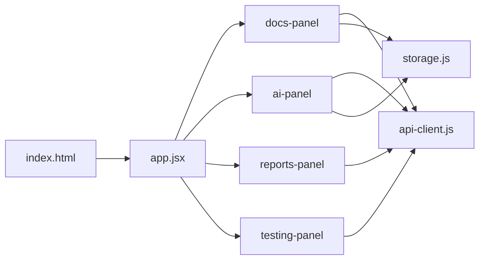

**Browser `localStorage` keys:**

| Key | Contents |
|-----|----------|
| `shipmozo-chat-v1` | Chat history |
| `shipmozo-docs-v1` | In-progress Module Docs draft |
| `shipmozo-testing-v1` | Testing panel form state |
| `shipmozo-github-repo-v1` | GitHub repo URL for PRD context |

Server wipe: `POST /api/app/clear-data` → `lib/clear-app-data.js`.

### 4.2 Backend (Express API)

Single entry point: `server.js` (~1,800 lines). Responsibilities:

- REST API for docs, testing, chat, reports, AI config
- Static file hosting (`public/`, `output/cloud-images/`, `output/test-runs/`)
- Async job orchestration (in-memory Maps + optional disk persist)
- Python subprocess spawning via `lib/spawn-python.js`

**API domains:**

| Domain | Key routes | Libraries |
|--------|------------|-----------|
| Health | `GET /api/health` | `lib/public-url.js`, `lib/ai-scope.js` |
| AI config | `/api/ai/config`, `/api/ai/test` | `lib/ai-config.js`, `lib/llm.js` |
| Panel nav | `/api/panel/navigation`, `/api/panel/discover-navigation` | `lib/panel-navigation.js` |
| Module docs | `/api/docs/generate-step/*`, `/api/docs/screenshots/*` | `lib/doc-generation.js` |
| Testing | `/api/testing/*` (datasets, runs, run-step, e2e-batch, hybrid) | `lib/test-dataset-runner.js`, etc. |
| Reports | `/api/reports/*` | `lib/report-archive.js`, `lib/report-retrieval.js` |
| Chat | `/api/ai/chat`, `/api/ai/chat/browse` | `lib/report-retrieval.js`, `lib/panel-browse.js` |

### 4.3 Python / Playwright layer

Node spawns Python via `lib/spawn-python.js` — serialized execution with per-run `killKey` for cancellation.

| Category | Files | Role |
|----------|-------|------|
| Login | `shipmozo_login.py` | Panel login → `output/shipmozo-state.json` |
| Doc capture | `capture_module_screenshots.py` | Screenshot pipeline for manuals |
| Test evidence | `capture_test_evidence.py` | Single-scenario screenshot (~180s with login) |
| E2E flows | `panel_e2e/*.py` | Rate calculator, orders, channel pages, nav heal |
| Batch runner | `run_panel_e2e_batch.py` | **One login, many scenarios** |
| Single runner | `run_panel_e2e.py` | One scenario, full login each time |
| Chat browse | `parse_panel_for_chat.py` | Live panel context for chat |
| Nav discovery | `discover_panel_navigation.py` | Build `data/panel-navigation.json` |

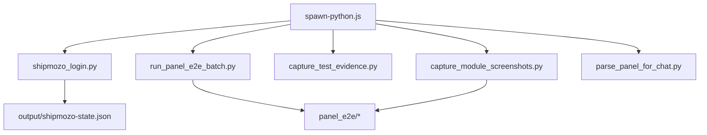

### 4.4 AI / LLM integration

**Provider registry:** `lib/providers.js` — OpenAI, Azure OpenAI, Claude, Gemini, OpenRouter.

| Use case | Default backend | Key files |
|----------|-----------------|-----------|
| PRD generation | Claude (split pipeline) | `lib/doc-generation.js`, `lib/report-llm-split.js` |
| Manual compilation | Azure OpenAI on Render | `lib/report-llm-split.js` |
| Chat | `CHAT_PROVIDER` env | `lib/llm.js`, `lib/report-retrieval.js` |
| Testcase design | Script-first (no AI) or Claude | `lib/test-dataset-generation.js` |
| Nav / screenshot heal | Playwright MCP + Claude | `lib/capture-mcp-claude-heal.js`, `lib/ai-e2e-heal.js` |

**Feature scopes** (`lib/ai-scope.js`): `chat`, `script_debug`, `testcase_gen`, `report_gen` — each can be toggled independently.

**Chat knowledge retrieval:**

1. User query → `searchReports()` token search over saved report chunks
2. Top chunks injected into system prompt (`buildKnowledgeSystemPrompt`)
3. Optional: live panel browse (`parse_panel_for_chat.py`) merged via `buildHybridSystemPrompt`
4. Optional: GitHub repo tree (`lib/github-repo-context.js`)
5. `callLLM()` with selected provider

---

## 5. Storage Model

### 5.1 Current (filesystem + Cloudinary)

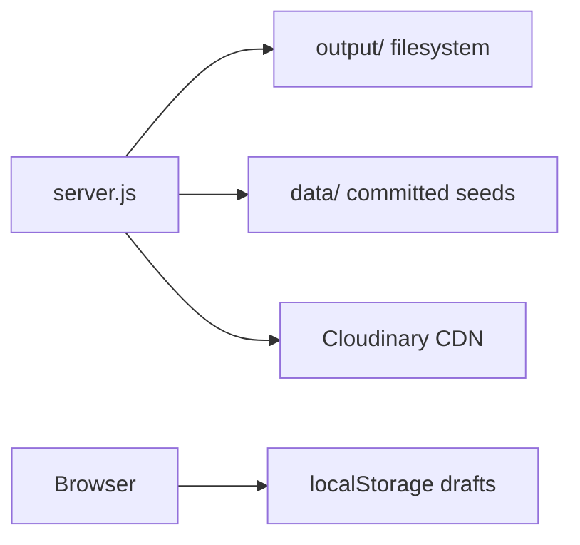

| Domain | Local path | Cloud (Render) |
|--------|------------|----------------|
| Screenshots / videos | `output/cloud-images/{sessionId}/` | Cloudinary `shipmozo-manuals/` |
| Reports (PRD, manual, JSON) | `output/reports/{sessionId}/` | Cloudinary raw + manifest index |
| Test datasets | `output/test-datasets/{id}.json` | — |
| Test runs + artifacts | `output/test-runs/{runId}/` | — |
| Runtime jobs / cache | `output/runtime/` | Ephemeral on Render |
| Panel session | `output/shipmozo-state.json` | Ephemeral |
| Navigation map | `data/panel-navigation.json` | Git-committed seed |
| Heal lessons | `data/ai-heal-lessons.json` | Git-committed seed |
| AI config overlay | `.ai-config.json` | Local / env only |

**Libraries:** `lib/image-storage.js`, `lib/report-archive.js`, `lib/test-dataset-store.js`, `lib/test-run-store.js`

### 5.2 Recommended future (S3 + Postgres)

Not implemented today. Natural evolution for scale:

| Store | Contents | Replaces |
|-------|----------|----------|
| **S3** | Screenshots, videos, Newman JSON, large report blobs, nav script JSON | Cloudinary bulk + ephemeral `output/` |
| **Postgres** | Reports index, `report_chunks` (pgvector for RAG), datasets, runs, job status | JSON files + in-memory job Maps |
| **Redis** | Job queues between API and worker services | `setImmediate` in-process jobs |

**Rule of thumb:** Python runner **code** stays in git/image; runtime JSON (datasets, nav scripts, job state) moves to DB/S3.

---

## 6. Core Workflows

### 6.1 Module Docs (PRD → Screenshots → Manual)

**UI:** `docs-panel.jsx`  
**Goal:** Produce a searchable PRD + illustrated user manual for a Shipmozo module.

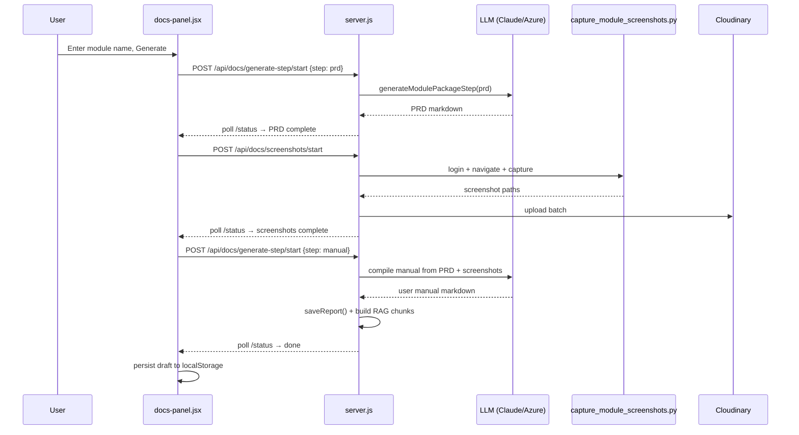

**Notes:**

- Steps 1 and 3 use **async jobs** (`lib/doc-step-job-store.js`) to avoid Render's ~30s gateway timeout (502 fix).
- Step 2 uses **async screenshot jobs** (`lib/screenshot-job-store.js`) with optional MCP heal (`DOCS_CAPTURE_HEAL_*`).
- On manual completion, `saveReport()` in `lib/report-archive.js` indexes the report for chat RAG.

### 6.2 Chat (RAG + optional live panel)

**UI:** `ai-panel.jsx`

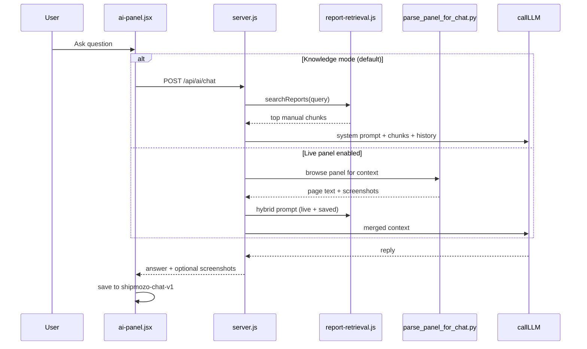

### 6.3 Test Run — Backend only

**UI:** `testing-panel.jsx` with `runTarget=backend`

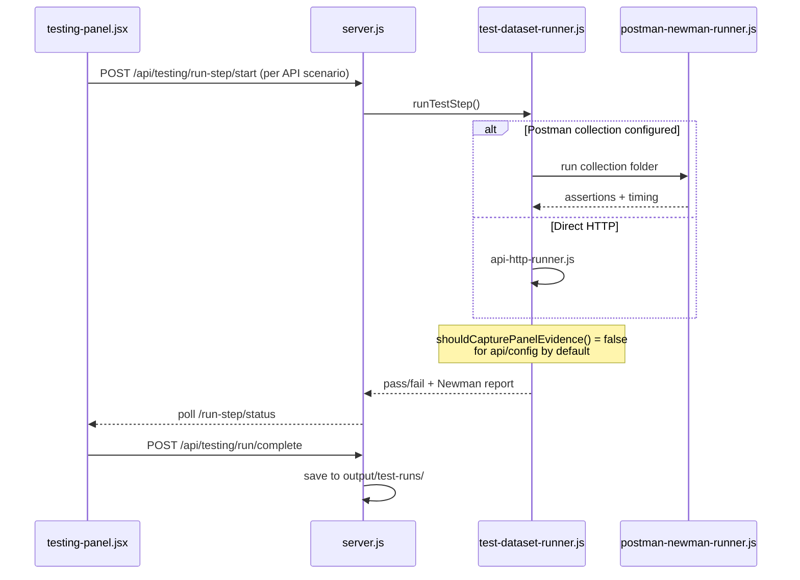

**Performance note:** API scenarios skip panel screenshot capture by default (`shouldCapturePanelEvidence` in `lib/test-dataset-runner.js`). Each evidence capture costs ~180s (login + screenshot). Override with `scenario.inputs.captureScreens=true` or `TEST_SKIP_API_EVIDENCE=false`.

### 6.4 Test Run — Frontend (E2E batch)

**UI:** `testing-panel.jsx` with `runTarget=frontend`

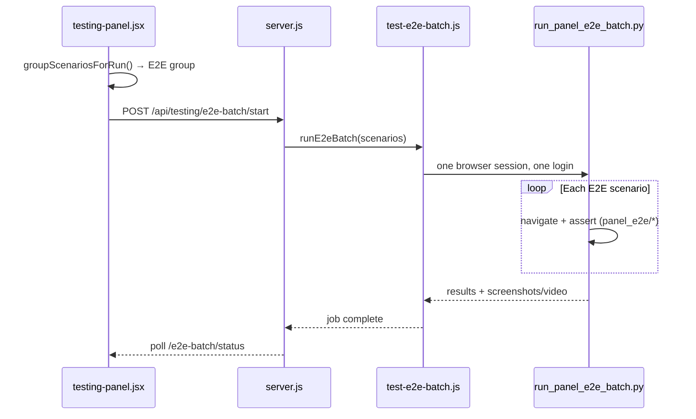

**Why batch matters:** `run_panel_e2e.py` (single scenario via `/run-step`) performs a **full login per test** (~137s each). `run_panel_e2e_batch.py` logs in once and runs N order/rate-calculator flows in one session.

### 6.5 Test Run — Both (hybrid)

**UI:** `testing-panel.jsx` with `runTarget=both`

1. `filterScenariosForRunTarget()` — API scenarios first, then UI
2. API scenarios: `/api/testing/run-step/start` (Newman or local HTTP)
3. E2E scenarios: `/api/testing/e2e-batch/start` with `runTarget: "both"`
4. Results label: `X passed · Y total` (all scenarios in dataset, not just executed count)
5. `POST /api/testing/run/complete` persists run history

Order-flow UI scenarios route to E2E batch via `isPanelE2eScenario()` in `lib/panel-ui-scenario.js`.

### 6.6 Report save and retrieval

**Save triggers:**

- Auto on Module Docs manual step completion
- Manual: `POST /api/reports/save`
- Chunks built from `user_manual` sections for token search

**Retrieval:**

| Action | Route | Library |
|--------|-------|---------|
| List all | `GET /api/reports` | `lib/report-archive.js` |
| Full report | `GET /api/reports/:sessionId` | `lib/report-archive.js` |
| Search (RAG) | `GET /api/reports/search?q=` | `lib/report-retrieval.js` |
| Delete | `DELETE /api/reports/:sessionId` | `lib/report-archive.js` |

On startup, `warmupReportArchive()` merges Cloudinary manifest with local index.

---

## 7. Async Job Architecture

All long-running work uses **start → poll** to stay under HTTP gateway timeouts.

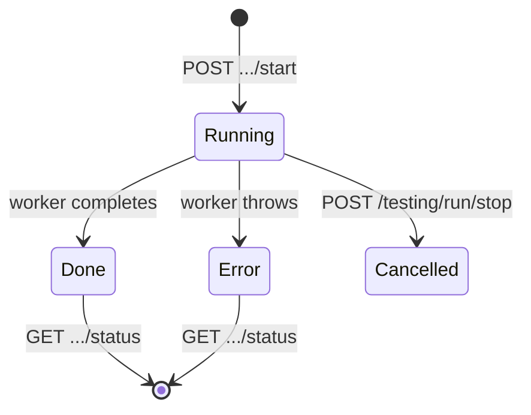

| Job type | Store | Start route | TTL | Disk persist |
|----------|-------|-------------|-----|--------------|
| Screenshot capture | `lib/screenshot-job-store.js` | `/api/docs/screenshots/start` | 1h | No |
| Doc step (PRD/manual) | `lib/doc-step-job-store.js` | `/api/docs/generate-step/start` | 1h | No |
| Test step | `lib/test-run-jobs.js` | `/api/testing/run-step/start` | 2h | Yes → `output/runtime/test-step-jobs/` |
| E2E batch | `lib/test-run-jobs.js` | `/api/testing/e2e-batch/start` | 2h | Partial |
| E2E heal | `lib/test-run-jobs.js` | `/api/testing/e2e-heal/start` | 2h | No |
| Testcase gen | `lib/testcase-gen-job-store.js` | `/api/testing/generate-from-docs/start` | 1h | No |

**Cancellation:** `POST /api/testing/run/stop` → `cancelJobsForRun()` + `killAllPythonForRun()`.

**Live heal progress:** `lib/heal-progress.js` writes `output/runtime/heal-{runId}.json` for UI polling.

**Render caveat:** Server redeploy clears in-memory jobs. Test-step jobs have disk backup; doc-step jobs do not (lost on restart).

---

## 8. Testing Pipeline Detail

### 8.1 Execution backends

| Layer | Env var | Default | Runner |
|-------|---------|---------|--------|
| Testcase design | `TESTCASE_BACKEND` | `scripts` | Import scripts, no AI |
| API execution | `API_RUN_BACKEND` | `local` | Newman or direct HTTP |
| UI heal | `SCRIPT_DEBUG_BACKEND` | `mcp` | Playwright MCP |

### 8.2 API execution paths

| Path | When | Library |
|------|------|---------|
| Newman | `POSTMAN_COLLECTION_ID` set | `lib/postman-newman-runner.js` |
| Direct HTTP | `SHIPMOZO_API_BASE_URL` set | `lib/api-http-runner.js` |
| Local routes | Default dev | `lib/test-dataset-runner.js` hits Dev Helper API |

### 8.3 UI execution paths

| Path | When | Cost |
|------|------|------|
| E2E batch | Order flows, rate calculator, grouped UI | One login per batch |
| E2E run-step | Single scenario, non-batchable | Full login per scenario (~137s+) |
| Panel evidence | `captureScreens: true` on API test | Login + screenshot (~180s) |

### 8.4 Hybrid pipeline (docs → tests)

`lib/hybrid-testing-pipeline.js` orchestrates:

1. Read saved PRD/manual from reports
2. Generate or merge API + UI scenario JSON
3. Optionally run Postman MCP agent for API collection design
4. Execute merged suite (API then E2E batch)

---

## 9. External Integrations

| Service | Purpose | Config |
|---------|---------|--------|
| Shipmozo Panel | Login, screenshots, E2E | `SHIPMOZO_PANEL_URL`, `SHIPMOZO_EMAIL`, `SHIPMOZO_PASSWORD` |
| Postman API | Fetch collections/environments | `POSTMAN_API_KEY`, `POSTMAN_COLLECTION_ID` |
| Newman (npm) | Headless API test execution | Bundled dependency |
| Postman MCP | AI collection design (not execution) | `POSTMAN_MCP_URL` |
| Cloudinary | Image + report CDN on Render | `CLOUDINARY_*`, `IMAGE_STORAGE`, `REPORT_STORAGE` |
| Azure OpenAI | Chat + manual on Render | `AZURE_OPENAI_*`, `CHAT_PROVIDER` |
| Claude (Anthropic) | PRD, heal, optional chat | `ANTHROPIC_API_KEY`, `ANTHROPIC_MODEL` |
| Playwright MCP | Nav/scenario debug heal | `PLAYWRIGHT_MCP_URL`, `PLAYWRIGHT_MCP_AUTO_START` |
| GitHub | Optional source context for PRD/chat | `GITHUB_REPO_URL`, `GITHUB_TOKEN` |
| Cloudflare Tunnel | Local public URL only | `PUBLIC_TUNNEL` |

---

## 10. Scalable Target Architecture

Today's monolith works for a small team on Render free tier. For speed and reliability at scale:

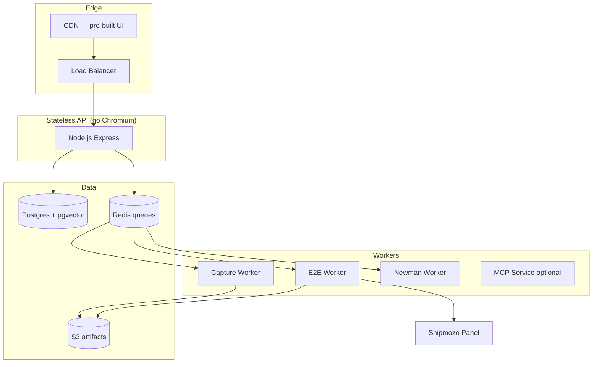

| Change | Benefit |
|--------|---------|
| Separate worker service (Playwright only) | API stays fast; no browser in web dyno |
| Redis job queue | Survives redeploys; horizontal workers |
| Postgres + pgvector | Durable reports, datasets, RAG chunks |
| S3 for blobs | Cheap storage; no ephemeral disk loss |
| Pre-built Vite UI on CDN | Faster load; no Babel in browser |

---

## 11. Key Environment Variables

### Deployment

```
NODE_ENV, PORT, HOST
RENDER, RENDER_EXTERNAL_URL, PUBLIC_BASE_URL, PUBLIC_TUNNEL
IMAGE_STORAGE, REPORT_STORAGE
CLOUDINARY_CLOUD_NAME, CLOUDINARY_API_KEY, CLOUDINARY_API_SECRET
PLAYWRIGHT_BROWSERS_PATH, PLAYWRIGHT_NO_SANDBOX, PYTHON_BIN, HEADLESS
```

### Panel & API

```
SHIPMOZO_PANEL_URL, SHIPMOZO_EMAIL, SHIPMOZO_PASSWORD
SHIPMOZO_API_BASE_URL, SHIPMOZO_API_TOKEN
POSTMAN_API_KEY, POSTMAN_COLLECTION_ID, POSTMAN_ENVIRONMENT_ID
```

### AI

```
CHAT_PROVIDER, AI_PROVIDER, AI_SCOPE
ANTHROPIC_API_KEY, AZURE_OPENAI_ENDPOINT, AZURE_OPENAI_API_KEY, AZURE_OPENAI_DEPLOYMENT
REPORT_BACKEND, REPORT_PRD_PROVIDER, REPORT_MANUAL_PROVIDER
TESTCASE_BACKEND, SCRIPT_DEBUG_BACKEND
PLAYWRIGHT_MCP_URL, PLAYWRIGHT_MCP_AUTO_START
```

### Testing performance

```
TEST_SKIP_API_EVIDENCE=true     # default: skip ~180s panel capture on API tests
DOCS_RECORD_VIDEO=false         # Render: screenshots only
PANEL_E2E_BATCH_TIMEOUT_MS
TEST_EVIDENCE_TIMEOUT_MS
```

Full reference: `.env.example`

---

## 12. Repository Map

```
shipmozo-dev-helper/
├── server.js                 # Express monolith — API + static + job orchestration
├── public/                   # Babel SPA (panels, api-client, storage)
├── lib/                      # ~60 Node modules (AI, testing, storage, MCP)
├── data/                     # panel-navigation.json, ai-heal-lessons.json
├── output/                   # Runtime artifacts (gitignored)
├── panel_e2e/                # Python E2E flow modules
├── *.py                      # Playwright automation entry points
├── scripts/render-build.sh   # Render production build
├── render.yaml               # Render blueprint
├── requirements.txt          # Python: playwright==1.60.0
└── docs/
    ├── ARCHITECTURE.md       # This document
    └── TESTING-WORKFLOW.md   # Hands-on testing guide
```

---

## 13. Related Documents

- [TESTING-WORKFLOW.md](./TESTING-WORKFLOW.md) — Step-by-step hybrid API + UI testing
- `.env.example` — Full environment variable reference
- `GET /api/health` — Live feature flags, URLs, and storage mode
